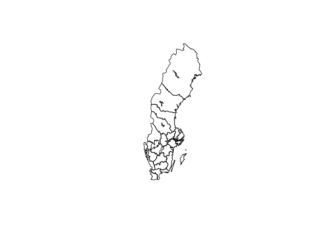
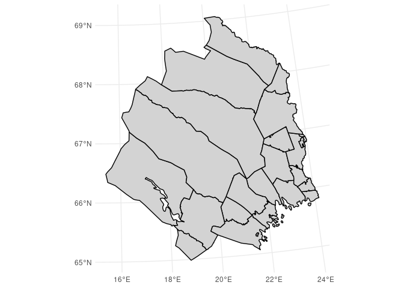
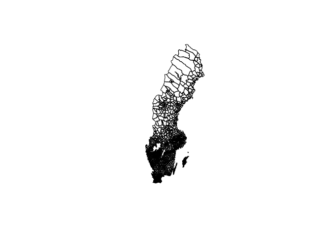

<!-- README.md is generated from README.Rmd. Please edit that file -->
Swedish historical administrative maps
======================================

A R data package of Swedish historical administrative boundaries for parishes and counties 1634-1990.

Source
------

"Historiska GIS-kartor (information om territoriella indelningar i Sverige från 1500-talets slut till 1900-talets slut)" historical GIS data from the Swedish National Archive released under [Creative Commons CCZero](https://creativecommons.org/publicdomain/zero/1.0/).

The map projection is RT90 EPSG:2400

County map
----------

``` r
library(histmaps)
```

    ## Warning: replacing previous import 'dplyr::union' by 'igraph::union' when
    ## loading 'histmaps'

    ## Warning: replacing previous import 'dplyr::as_data_frame' by
    ## 'igraph::as_data_frame' when loading 'histmaps'

    ## Warning: replacing previous import 'dplyr::groups' by 'igraph::groups' when
    ## loading 'histmaps'

    ## Warning: replacing previous import 'dplyr::%>%' by 'igraph::%>%' when
    ## loading 'histmaps'

``` r
library(maptools)
library(sp)
map <- hist_boundaries(1800, "county")
plot(map)
```



Parish map
----------

``` r
library(knitr)
library(ggplot2)
library(dplyr)

p_map <- hist_boundaries("1866-06-06", "parish", "df")

st_map <- p_map %>% filter(county < 3)
ggplot(st_map, aes(long, lat, group = group)) +
  geom_polygon(fill = "lightgrey", color = "black") + coord_equal() + 
  theme_void()
```



Period map
----------

As parishes changes boundaries over the course of history a given map a certain year is not representative of the boundaries another year. To create a map for a period the parishes need to be aggregated to the lowest common denominator for that period. You can do this by supplying a date range to `hist_boundaries`.

``` r
period_map <- hist_boundaries(c(1900, 1920)) 
```

The function returns a list where the first object is the map data and the second is a lookup table for aggregating your data to the new artificial parish boundaries.

``` r
plot(period_map$map)
```



``` r
kable(head(period_map$lookup))
```

|     nadkod|  geomid|
|----------:|-------:|
|  148010000|       1|
|  148012000|       2|
|  228102000|       3|
|  228401000|       4|
|  242501000|       5|
|  242502000|       5|
