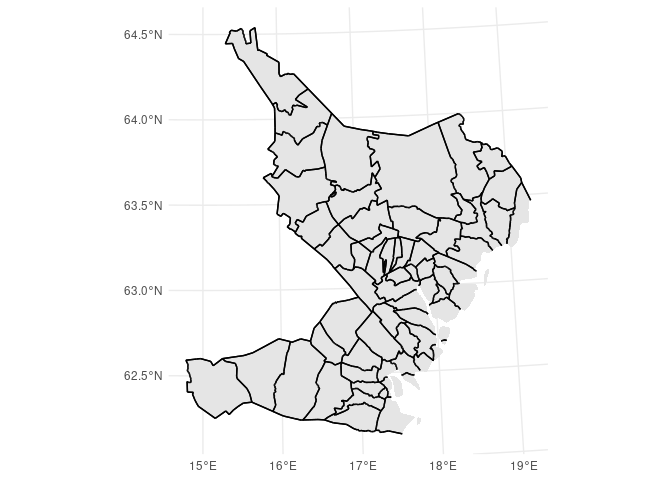
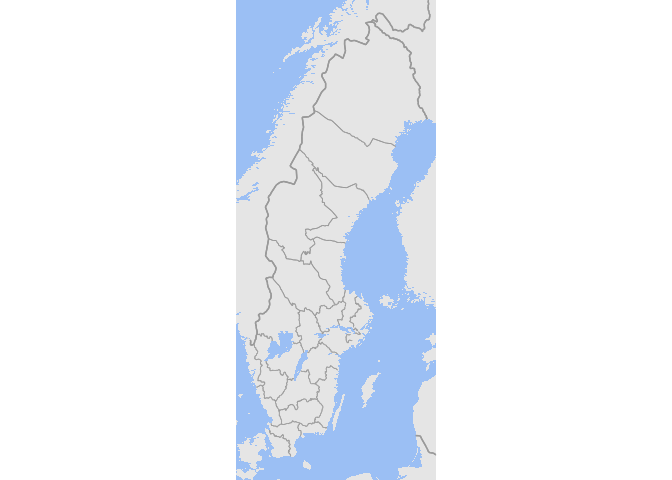

<!-- README.md is generated from README.Rmd. Please edit that file -->

# Swedish historical administrative maps

<!-- Generated by the R Markdown file README.Rmd -->

A R data package of Swedish historical administrative boundaries for
parishes and counties 1600-1990. Municipal, Pastorship, Parish,
Bailiwick, Contract, Magistrates court, Hundred, District court, County,
Diocese and Court.

Based upon historical GIS data from the Swedish National Archive. Data
on parishes and counties has been verified, while the other types of
units have not. Thus, be aware of possible inconsistencies and faults.

### Source

“Historiska GIS-kartor (information om territoriella indelningar i
Sverige från 1500-talets slut till 1900-talets slut)” historical GIS
data from the Swedish National Archive released under Creative Commons
CCZero.

The map projection is SWEREF99 EPSG:3006

## County map

``` r
library(histmaps)
library(sf)
```

    ## Linking to GEOS 3.10.1, GDAL 3.4.0, PROJ 8.2.0; sf_use_s2() is TRUE

``` r
library(tidyverse)
```

    ## ── Attaching packages ─────────────────────────────────────── tidyverse 1.3.1 ──

    ## ✓ ggplot2 3.3.5     ✓ purrr   0.3.4
    ## ✓ tibble  3.1.3     ✓ dplyr   1.0.7
    ## ✓ tidyr   1.1.3     ✓ stringr 1.4.0
    ## ✓ readr   2.0.1     ✓ forcats 0.5.1

    ## ── Conflicts ────────────────────────────────────────── tidyverse_conflicts() ──
    ## x dplyr::filter() masks stats::filter()
    ## x dplyr::lag()    masks stats::lag()

``` r
map <- get_boundaries(1800, "county")
plot(st_geometry(map))
```


## Parish map

Meta data for parishes and counties are collected in a separate file.

``` r
data("geom_meta")

geom_meta %>% 
  filter(type_id == "parish") %>% 
  head() %>% 
  knitr::kable()
```

| geom_id | topo_id                                | ref_code     | county | letter | center | name.x                  | name.y       | type_id |    nadkod | grkod | dedik | dedikscb | forkod | from |  tom |
|--------:|:---------------------------------------|:-------------|-------:|:-------|:-------|:------------------------|:-------------|:--------|----------:|------:|------:|---------:|-------:|-----:|-----:|
|   15293 | {9396AF46-A0B0-11D3-9E53-009027B0FCE9} | SE/230301000 |     22 | NA     | NA     | Ragunda församling      | RAGUNDA      | parish  | 230301000 |   900 | 83750 |   230301 | 230301 |    0 | 1809 |
|   15294 | {9396AF46-A0B0-11D3-9E53-009027B0FCE9} | SE/230301000 |     23 | NA     | NA     | Ragunda församling      | RAGUNDA      | parish  | 230301000 |   900 | 83750 |   230301 | 230301 | 1810 | 9999 |
|   15536 | {9396AF47-A0B0-11D3-9E53-009027B0FCE9} | SE/230302000 |     22 | NA     | NA     | Fors församling (Z-län) | FORS (Z-län) | parish  | 230302000 |   900 | 83760 |   230302 | 230302 |    0 | 1809 |
|   15537 | {9396AF47-A0B0-11D3-9E53-009027B0FCE9} | SE/230302000 |     23 | NA     | NA     | Fors församling (Z-län) | FORS (Z-län) | parish  | 230302000 |   900 | 83760 |   230302 | 230302 | 1810 | 9999 |
|   14444 | {9396AF48-A0B0-11D3-9E53-009027B0FCE9} | SE/230303000 |     22 | NA     | NA     | Borgvattnets församling | BORGVATTNET  | parish  | 230303000 |   900 | 83740 |   230303 | 230303 | 1781 | 1809 |
|   14445 | {9396AF48-A0B0-11D3-9E53-009027B0FCE9} | SE/230303000 |     23 | NA     | NA     | Borgvattnets församling | BORGVATTNET  | parish  | 230303000 |   900 | 83740 |   230303 | 230303 | 1810 | 9999 |

Meta data wich can be used to easly subset data, for example by county.

``` r
p_map <- get_boundaries("1866", "parish")


st_map <- p_map %>% left_join(geom_meta, by = c("geom_id"))

st_map %>% filter(county == 25) %>% 
  ggplot() +
  geom_sf(fill = "lightgrey", color = "black") +
  theme_minimal()
```


## Period map

As parishes changes boundaries over the course of history a given map a
certain year is not representative of the boundaries another year. To
create a map for a period the parishes need to be aggregated to the
lowest common denominator for that period. You can do this by supplying
a date range to `get_boundaries`.

``` r
period_map <- get_boundaries(c(1900, 1920), type = "parish") 
```

The function returns a list where the first object is the map data and
the second is a lookup-table for aggregating your data to the new
artificial parish boundaries.

``` r
plot(st_geometry(period_map$map))
```


``` r
knitr::kable(head(period_map$lookup))
```

| geom_id | geomid |
|--------:|-------:|
|    2562 |      1 |
|    3891 |      2 |
|     790 |      3 |
|     692 |      4 |
|     696 |      5 |
|     740 |      6 |

## Map with boundaries

``` r
data("geom_borders")

st_map_borders <- geom_borders %>% 
  filter(start <= 1866, end >= 1866) %>% 
  left_join(geom_meta, by = c("geom_id"))


ggplot() +
  geom_sf(data = st_map %>% filter(county == 22), color = NA) +
  geom_sf(data = st_map_borders %>% filter(county == 22)) + 
  theme_minimal()
```

 ## Adding
background map

``` r
data("eu_geom")
data("eu_border")

eu_1900 <- eu_geom %>% filter(year == 1900) %>% st_transform(st_crs(map))
eu_border_1900 <- eu_border %>% filter(year == 1900)%>% st_transform(st_crs(map))

county_map <- geom_borders %>% filter(start <= 1900, end >= 1900, type_id == "county")

lims <- st_bbox(map)

ggplot() +
  geom_sf(data = eu_1900, color = NA) +
  geom_sf(data =county_map, color = "gray60", size = .3) +
  geom_sf(data = eu_border_1900, color = "gray60") +
  coord_sf(xlim = lims[c(1,3)], ylim = lims[c(2,4)])  +
  theme_void() +
  theme(panel.background = element_rect(fill = "#9bbff4", color =NA))
```


