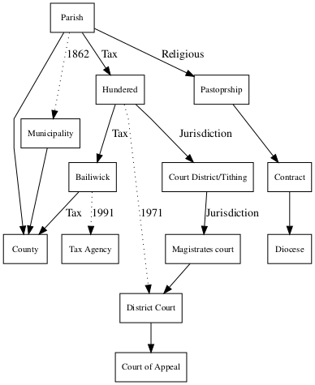

# Introduction

Swedish historical administrative maps hold significant value for
research in various fields such as history, geography, demography, and
social sciences. These maps provide essential insights into the
evolution of administrative units, which have undergone numerous changes
across the centuries. For example, in 1600 there were 20 counties in
Sweden, in 1990 there were 24. Over the centuries counties has not only
split up and merged but the borders of the counties has been in constant
flux. The map in Figure \@ref(fig:countyboundary) illustrates the
boundary changes of counties from 1600 to 1990, revealing the extent and
frequency of these modifications over time. Understanding these shifts
is crucial for accurate data analysis. This technical report presents
histmaps, an R package designed to facilitate easy access,
visualization, and analysis of Swedish historical administrative
boundaries, while accounting for changes in boundaries.

```{r, include=F}
knitr::opts_chunk$set(
  message = F,
  warning = F
)

library(histmaps)
library(sf)
library(tidyverse)
```

```{r countyboundary, echo = F, fig.cap="County changes from 1600 to 1990"}
data(geom_sp)

counties_all <- geom_sp %>% filter(type_id == "county")

ggplot(counties_all) + 
  geom_sf(alpha = .1, fill = "black") + 
  theme_void() +
  coord_sf(
    xlim = c(
      min(st_bbox(counties_all)[c(1, 3)]), 
      max(st_bbox(counties_all)[c(1, 3)]) + 60e4 
    ),
    expand = FALSE
  ) +
  annotate(
    geom = "text",
    x = max(st_bbox(counties_all)[c(1, 3)]) + 1,  
    y = mean(st_bbox(counties_all)[c(2, 4)]), 
    label = "Darker colors represents\ngreater number of\nboundary changes",
    hjust = 0, 
    vjust = 0.5, 
    size = 4, 
    fontface = "italic", 
    family = "sans", 
    color = "black" 
  )

```

The R package utilizes historical GIS data from the Swedish National
Archive, covering administrative boundaries from the late 16th century
to the late 20th century. The package simplifies the process of
analyzing aggregate data based on administrative units, making it an
invaluable tool for researchers working with historical Swedish data.

One of the primary purposes of the R package is to make it easier to
analyze aggregate data based on administrative units, while accounting
for changes in boundaries over time. This enables researchers to better
understand the impact of historical events on the administrative
divisions in Sweden and accurately analyze population changes across
different administrative units.

The scope of the R package includes various administrative units, such
as Municipal, Pastorship, Parish, Bailiwick, Contract, Magistrates
court, Hundred, District court, County, Diocese, and Court. Data on
parishes and counties has been verified for accuracy, but users should
be aware that the other types of units have not been thoroughly vetted
and may contain inconsistencies or faults. The package uses the SWEREF99
EPSG:3006 map projection for all visualizations.

With this R package, users can easily plot county and parish maps,
extract metadata for specific administrative units, and create period
maps by aggregating boundaries within a specified date range. By
facilitating a deeper understanding of the changes in Swedish
administrative boundaries over time, this package opens up new avenues
for research in a variety of fields.Data sources

The R package histmaps utilizes data from the Swedish National Archives
(Riksarkivet) called "Historiska GIS-kartor (information om
territoriella indelningar i Sverige från 1500-talets slut till
1900-talets slut)". This dataset was developed within the scope of the
QVIZ project, which aimed to create a common access point for Europe's
digital archival material by making it searchable through time and
location.

QVIZ, or Query and Context-Based Visualization of Time-Spatial Cultural
Dynamics, was an EU-funded research project that ran from May 2006 for
24 months. It was coordinated by HUMlab at Umeå University, with other
project partners including the Swedish National Archives, Demographic
Database, Research Archives, Department of Religious Studies at Umeå
University, Salzburg Research Forschungsgesellschaft, AS Regio, Estonian
National Archives, University of Portsmouth, and Telefónica.

The project aimed to develop a framework to make digital archival
material accessible through maps, where users could contribute to and
collaborate on the material. Maps provided a unifying and coherent
access point to extensive archival materials, with a temporal dimension.
By specifying time and geographical area, users could, for example, find
all available information about a parish during a certain period.

The last updates to the dataset were made at the University of
Portsmouth in 2008, and since then, Riksarkivet has ceased working on
the geographical data. Although the data is no longer available directly
from Riksarkivet, it was released under the Creative Commons CCZero
license, allowing the histmaps package to incorporate the historical
Swedish GIS maps detailing territorial divisions from the late 16th
century to the late 20th century.

In addition to the data from Riksarkivet, the histmaps package also
provides data on administrative boundaries of Europe for the years 1900,
1930, 1960, 1990, and 2003. This data comes from the MPIDR Population
History GIS Collection, a dataset designed to support demographic and
socioeconomic research by filling gaps in the European
GIS-data-infrastructure on historical national and regional
administrative boundaries and historical place names.

The MPIDR Population History GIS Collection can be freely used for
non-commercial scientific purposes, as long as users register with the
Mosaic project and properly cite the source. It is important to note
that the maps used in this project are partly based on the following
source: © EuroGeographics for the administrative boundaries.

By incorporating data from both Riksarkivet and the MPIDR Population
History GIS Collection, the histmaps package offers a comprehensive
resource for users interested in exploring historical administrative
boundaries and place names across Europe.

## License

The R package histmaps is licensed under the MIT License. The MIT
License is a permissive open-source software license that allows users
to freely use, copy, modify, merge, publish, distribute, sublicense, and
even sell copies of the software, provided that the original copyright
notice and the permission notice are included in all copies or
substantial portions of the software.

The data from Riksarkivet is licensed under the Creative Commons CCZero
(CC0) License. The CC0 License is a public domain dedication that allows
creators to waive all of their copyright and related rights in a work,
effectively placing it in the public domain. This means that users can
copy, modify, distribute, and perform the work, even for commercial
purposes, without asking for permission.

For users of the histmaps package and the data from Riksarkivet, these
licensing terms provide significant freedom in terms of usage,
modification, and distribution. Users can confidently work with the data
and the package, knowing that they have the necessary permissions to
adapt and share their work as needed, even for commercial purposes.
However, it is always recommended to give appropriate credit to the
original sources and maintain the original copyright and permission
notices as a matter of good practice.

# Dataset Overview

The histmaps R package provides access to historical geographic data for
Sweden, covering various administrative and territorial divisions from
the late 1500s to the end of the 1900s. The administrative units and
structure within Sweden have evolved over time, encompassing a complex
and intricate web of relationships and changes. As such, it can be
challenging to accurately capture the historical evolution of these
units. In this description, we present a simplified representation of
the Swedish administrative structure represented in the data,
emphasizing the importance of parishes as the foundational level. While
this simplified depiction offers a valuable starting point for
understanding the hierarchy of administrative units, it is crucial to
recognize that the actual historical context is far more complex, and
this representation may not capture all nuances and alterations that
have occurred over time.

The dataset includes information on the following geographic unit types:

| **English**       | **Swedish**              | **Start** | **End** | **Units** | **Geoms** |
|-------------------|--------------------------|-----------|---------|-----------|-----------|
| Diocese           | Stift                    | 1600      | 1970    | 371       | 521       |
| Contract          | Kontrakt                 | 1600      | 1990    | 442       | 959       |
| Pastorship        | Pastorat                 | 1600      | 1990    | 297       | 423       |
| Parish            | Kyrksocken               | 1683      | 1990    | 6         | 20        |
| Municipal         | Kommun / stad            | 1863      | 1990    | 2933      | 3543      |
| Court of Appeal   | Hovrätt                  | 1600      | 1990    | 269       | 539       |
| County            | Län                      | 1600      | 1990    | 2714      | 3081      |
| District court    | Tingsrätt                | 1686      | 1990    | 30        | 80        |
| Hundred           | Härad / stad / skeppslag | 1600      | 1990    | 1885      | 3108      |
| Magistrates court | Domsaga / rådhusrätt     | 1600      | 1990    | 13        | 37        |
| Bailiwick         | Fögderi / stad           | 1971      | 1990    | 110       | 143       |

-   Parish ("Socken/Församling"): A parish is a historical
    administrative and ecclesiastical unit in Sweden. Parishes have
    their origin in the early Middle Ages and formed the basis for both
    ecclesiastical and civil administration. A parish was usually a
    geographical area with a church in the center, administered by a
    parish assembly, where residents could participate in
    decision-making. Congregations are responsible for performing
    ecclesiastical tasks such as baptisms, weddings, and funerals, as
    well as conducting worship services and religious education.
    Congregations are administered by the church council and parish
    council. The 1862 municipal reform replaced parishes with
    municipalities as the primary local administrative unit.

-   Pastorship ("Pastorat"): A pastorship is a grouping of one or more
    parishes under the administration of a single clergyman or
    clergywoman, often a vicar. These groupings have changed over time
    as parishes have been combined, split, or dissolved.

-   Contract ("Kontrakt"): A "kontrakt" (prosteri) is an administrative
    division within a Swedish diocese, grouping several parishes
    together for organizational and administrative purposes. They have
    existed since the 17th century and have evolved over time.

-   Diocese ("Stift"): A diocese is a territorial division of the Church
    of Sweden, overseen by a bishop. It has existed since the Middle
    Ages and has undergone several territorial changes throughout
    history, reflecting the evolving organization of the church.

-   Municipality (Kommun): A municipality is the smallest administrative
    unit in Sweden and is responsible for basic services and
    infrastructure such as education, care, environmental protection,
    urban planning, and emergency services. Municipalities have a
    municipal executive board and a municipal assembly that decide on
    the municipality's budget and guidelines. The 1862 municipal reform
    replaced parishes with municipalities, and the current municipal
    structure was completed in

    1971. 

-   Court of Appeal (Hovrätt): A Court of Appeal is a regional appellate
    court in Sweden. Established in the 17th century, the Courts of
    Appeal handle appeals of judgments from district courts and decide
    whether they should be changed, confirmed, or annulled. There are
    six Courts of Appeal in Sweden, divided geographically.

-   County (Län): A county is an administrative unit in Sweden and
    represents an intermediate level between municipalities and the
    state. The county is led by a governor appointed by the government.
    The county's task is to ensure that decisions made by the Parliament
    and government are implemented in the region. County administration
    is managed by the County Administrative Board, responsible for areas
    such as supervision, environmental protection, crisis management,
    and regional development.

-   District Court (Tingsrätt): A District Court is a general court at
    the first level in Sweden. District courts handle both criminal
    cases and civil disputes, as well as matters related to family law,
    bankruptcy, and enforcement. The court is led by a chief judge and
    consists of regular judges, lay judges, and clerical staff.

-   District (Härad): A district was a historical administrative and
    judicial unit in Sweden, corresponding to a group of parishes.
    During the Middle Ages and up to the 20th century, districts formed
    the basis of local jurisdiction, with district courts responsible
    for the administration of justice and decision-making in cases
    involving the district's residents. Districts were also units for
    dividing tax-paying and crown farmers. Districts disappeared as
    administrative units with the 1862 municipal reform but continued
    within the judiciary until 1971 when district courts replaced
    district and city courts.

-   Judicial District (Domsaga): A judicial district is a geographical
    division of courts in Sweden. Judicial districts were an
    intermediate level between district and Court of Appeal and were
    divided into judicial circuits or districts. Judicial districts were
    introduced in the 17th century and abolished with the 1971 judicial
    reform when district courts replaced district and city courts, and
    judicial districts were replaced by judicial circuits.

-   Tax Collection District (Fögderi): A tax collection district was an
    administrative unit in Sweden until 1991, whose primary task was to
    be responsible for the collection of taxes and fees and to perform
    certain supervisory tasks. Tax collection districts were subordinate
    to the County Administrative Board and were usually divided
    according to districts or judicial districts. Tax collection
    districts were abolished and replaced by the Swedish Tax Agency,
    which is now responsible for tax collection and supervision at

The geographic units are organized into a administrative structure
according to the historical administrative structure of Sweden at the
time. The administrative structure of these Swedish units can be
visualized as a hierarchical arrangement see Figure \@ref(fig:diagram),
where smaller units are nested within larger ones.

```{r, include = FALSE}
library(DiagrammeR)
graph <- grViz('digraph G {
  graph [rankdir = "TB", splines=polyline];
  node [shape=box, fontsize=11];

  p [label="Parish"];
  m [label="Municipality"];
  co [label="County"];
  d [label="Hundered"];
  jd [label="Magistrates court"]; # domsaga
  dc [label="District Court"];
  ca [label="Court of Appeal"];
  td [label="Bailiwick"];
  ta [label="Tax Agency"];
  cd [label="Court District/Tithing"];
  ps [label="Pastoprship"]
  cn [label="Contract"]
  di [label="Diocese"]

  p -> m [style=dotted, label="1862"];
  p -> co;
  m -> co;

  p -> ps [label="Religious"]
  ps -> cn 
  cn -> di
  
  jd -> dc;
  d -> dc [style=dotted, label="1971"];
  dc -> ca;

  p -> d [label="Tax"];
  d -> td [label="Tax"];
  td -> co [label="Tax"];
  td -> ta [style=dotted, label="1991"];

  d -> cd [label="Jurisdiction"];
  cd -> jd [label="Jurisdiction"];
}')


svg_g <- DiagrammeRsvg::export_svg(graph)
svg_g %>% charToRaw() %>% rsvg::rsvg_png('adminmodel.png')
```

```{r diagram, echo = FALSE, fig.caption = "Hierarchy of Swedish Administrative Units"}

```

## Projections

SWEREF99 (EPSG:3006) projection, which is a widely used projection for
visualizing Swedish administrative boundaries. SWEREF99 is a national
coordinate system for Sweden based on the ETRS89 reference system, and
it provides accurate representation of locations and distances
throughout the country.

The SWEREF99 projection is particularly well-suited for visualizations
of Swedish administrative boundaries due to its minimal distortion and
accuracy in representing distances and areas. This makes it an ideal
choice for studying and analyzing historical and contemporary geographic
data in Sweden.

However, when visualizing smaller parts of Sweden, such as the
Västerbotten region, local projections may be more suitable (SWEREF 99,
2023). For instance, using a local projection specifically designed for
Västerbotten such as SWEREF99 20 15 (EPSG:3016) or a regional projection
that covers Northern Sweden can help provide even more accurate
representations of the area. These local or regional projections will
better account for the specific characteristics of the region, ensuring
that the visualizations are as accurate as possible for the area of
interest.

In addition to the SWEREF99 (EPSG:3006) projection for Swedish data, the
European datasets in the R package use the ETRS89-extended / LAEA Europe
(EPSG:3035) projection. This choice is appropriate for visualizing data
across Europe due to its specific properties and benefits.

The ETRS89-extended / LAEA Europe (EPSG:3035) projection is based on the
ETRS89 reference system, which is the standard geodetic reference system
for Europe. This Lambert Azimuthal Equal Area (LAEA) projection is
particularly well-suited for continent-wide visualizations because it
preserves the relative size of areas across the entire continent. This
means that the size of administrative boundaries, countries, and regions
are represented accurately in relation to one another, making it easier
to compare and analyze data across different parts of Europe.

Moreover, the LAEA projection minimizes distortion in shape, area, and
distance, especially in the central part of the map. This makes it an
ideal choice for visualizations that cover the entire European continent
or a significant portion of it, ensuring that the geographic data is
presented as accurately as possible for research and analysis purposes.

## Data Tables

The **`histmaps`** R package includes a collection of datasets that
provide detailed information on the historical administrative divisions
and boundaries of Sweden, as well as some European countries, from the
16th to the 20th century. These datasets offer valuable insights into
the geographical organization and historical evolution of these areas,
enabling researchers, historians, and other users to explore and analyze
the data in depth.

The primary dataset, **`geom_sp`**, contains information on the
administrative geographical divisions of various Swedish units,
including Municipal, Pastorship, Parish, Bailiwick, Contract,
Magistrates court, Hundred, District court, County, Diocese, and Court.
Alongside this primary dataset, additional datasets such as
**`geom_meta`**, **`eu_geom`**, **`eu_border`**, **`geom_borders`**,
**`geom_relations`**, **`hist_town`**, and **`map_desc`** are also
provided, offering metadata, European administrative divisions, borders,
relationships between units, county towns, and descriptions of the
different unit types.

The datasets are structured as tables with multiple columns, providing
comprehensive information for each record. The following is a brief
overview of the datasets, highlighting their structure and contents.
Users are encouraged to explore these datasets further to better
understand the historical administrative divisions and boundaries of
Sweden and Europe.

### **geom_sp: Administrative boundaries of Sweden, 1600-1990**

This dataset provides information on the administrative geographical
division of Swedish administrative units, such as Municipal, Pastorship,
Parish, Bailiwick, Contract, Magistrates court, Hundred, District court,
County, Diocese, and Court. The projection system used is SWEREF99
(EPSG:3006).

| **Column** | **Description**                            |
|------------|--------------------------------------------|
| geom_id    | Unique ID                                  |
| topo_id    | Unique topographic ID                      |
| ref_code   | Geocodes from the Swedish National Archive |
| name       | Unity name                                 |
| type       | Name of unit type                          |
| type_id    | Unit type ID                               |
| start      | Start year                                 |
| end        | End year                                   |
| geometry   | Geometry                                   |

### **geom_meta: Meta data for Swedish administrative boundaries**

This dataset provides information on meta data for the administrative
division of Swedish counties and parishes.

| **Column** | **Description**                     |
|------------|-------------------------------------|
| geom_id    | ID of geom in geom_sp               |
| topo_id    | Topographic ID                      |
| ref_code   | Riksarkivet code                    |
| county     | County ID                           |
| letter     | County ID letter                    |
| center     | Administrative center of county     |
| name.x     | Name version 1                      |
| name.y     | Name version 2                      |
| type_id    | Type of unit, parish or county      |
| nadkod     | NAD code                            |
| grkod      | Unknown code                        |
| dedik      | Old DEDIK code                      |
| dedikscb   | Old DEDIK code used by SCB          |
| forkod     | Old parish code used by Riksarkivet |
| from       | Start year                          |
| tom        | End year                            |

### **eu_geom: Administrative division of the European states, 1900-2003**

This dataset provides information on the administrative division of
European states at varying geographic detail in 30-year intervals. The
projection system used is ETRS89-extended / LAEA Europe (EPSG:3035).

| **Column** | **Description** |
|------------|-----------------|
| country    | Country code    |
| name       | Country name    |
| year       | Year            |
| geom       | Geometry        |

### **eu_border: Borders of administrative division of the European states, 1900-2003**

This dataset provides information on the borders of administrative
division of European states at varying geographic detail in 30-year
intervals. The projection system used is ETRS89-extended / LAEA Europe
(EPSG:3035).

| **Column** | **Description** |
|------------|-----------------|
| country    | Country code    |
| name       | Country name    |
| year       | Year            |
| geom       | Geometry        |

### **geom_borders: Administrative borders of Sweden, 1600-1990**

This dataset provides supplementary information on the boundaries
(without the area) of the administrative geographical division of
Swedish administrative units. The projection system used is SWEREF99
(EPSG:3006).

| **Column** | **Description**                            |
|------------|--------------------------------------------|
| geom_id    | Unique ID                                  |
| borders    | Number of borders in collection            |
| ref_code   | Geocodes from the Swedish National Archive |
| start      | Start year                                 |
| end        | End year                                   |
| type_id    | Unit type ID                               |
| geometry   | Geometry                                   |

### **geom_relations: Geographical relatives of units**

This dataset provides information on the relations between units,
succeeding and preceding units.

| **Column** | **Description**                    |
|------------|------------------------------------|
| g1         | geom_id of unit 1                  |
| g2         | geom_id of unit 2                  |
| relation   | Type of relation ("pre" or "succ") |
| year       | Year of relationship               |
| type_id    | Unit type ID                       |

### **hist_town: County towns**

This dataset provides information on county towns (residensstad) in
Sweden. The projection system used is SWEREF99 (EPSG:3006).

| **Column** | **Description**  |
|------------|------------------|
| code       | County code      |
| town       | County town name |
| from       | From year        |
| tom        | To year          |

### **map_desc: Description of units**

This dataset provides a description of the different administrative
units in Sweden.

| **Column** | **Description**                              |
|------------|----------------------------------------------|
| type_id    | Unit type ID                                 |
| units      | Number of units of that type                 |
| bounds     | Number of unique years with boundary changes |
| start      | Start year                                   |
| end        | End year                                     |

# Extracting and Visualizing Administrative Boundaries

In this chapter, we will explore how to use the **`get_boundaries()`**
function from the **`histmaps`** package to extract administrative
boundaries of a specific type of unit and visualize them using the
**`sf`** and **`ggplot2`** packages.

## **Setup**

To begin, load the required packages:

```{r}
library(histmaps)
library(sf)
library(tidyverse)
```

## Extracting Administrative Boundaries

The **`get_boundaries()`** function allows you to obtain administrative
boundaries for a specific date and type of unit. For example, let's
extract the county boundaries for the year 1800:

```{r}
county_map <- get_boundaries(1800, "county")
```

You can also extract parish boundaries for a specific year, such as
1866:

```{r}
parish_map <- get_boundaries("1866", "parish")
```

## Visualizing Administrative Boundaries

To visualize the extracted boundaries, use the **`sf`** and
**`ggplot2`** packages. Here is an example of how to plot the county
boundaries we extracted earlier:

```{r}
plot(st_geometry(county_map))
```

For a more customized visualization, use **`ggplot2`**. Here is an
example of plotting the parish boundaries:

```{r}
parish_map_sf <- parish_map %>% left_join(geom_meta, by = c("geom_id"))

parish_map_sf %>%
  filter(county == 25) %>%
  ggplot() +
  geom_sf(fill = "lightgrey", color = "black") +
  theme_minimal()
```

## Extracting and Visualizing Administrative Boundaries with Polygons and Borders

In this section, we will demonstrate how to create a more informative
and visually appealing map by overlaying borders on top of polygons. We
will visualize the counties of Stockholm, Uppsala, and Södermanland
(counties 1, 3, and 4).

First, let's extract the polygons for the counties of interest using the
get_boundaries function:

```{r}
# Extract county polygons for Stockholm, Uppsala, and Södermanland
counties <- c(1, 2, 3, 4)
county_polygons <- get_boundaries(1990, "county")
# Add meta data to the county_polygons
selected_county_polygons <- county_polygons %>% 
  left_join(geom_meta, by = c("geom_id")) %>% 
  filter(county %in% counties)
```

Next, we will visualize the extracted boundaries using ggplot2:

```{r, fig.cap="Boudnaries of the counties of Stockholm, Uppsala, and Södermanland in 1870"}
ggplot(selected_county_polygons) +
  geom_sf(fill = "gray", color = "black") +
  scale_fill_grey(start = 0.5) + 
  theme_minimal()
```

The islands in the City of Stockholm is hard do distinguish as the black
borders around the islands take over most of the island polygons. Insted
we can use the borders data to add clarity to coastal lines. Setting the
argument boundary_type to "borders", the function return a data on the
borders between adjacent polygons, without the borders around islands
and coastal lines.

First, let's extract the borders for the same counties:

```{r}
# Extract county borders for Stockholm, Uppsala, and Södermanland
county_borders <- get_boundaries(date = 1990, type = "county", boundary_type = "borders")
selected_county_borders <- county_borders %>% 
  left_join(geom_meta, by = c("geom_id")) %>% 
  filter(county %in% counties)

```

Final we can remove the border color from the polygons and add the
borders data for the counties. Additonlly we can use the local
projection for the Stockholm area, SWEREF99 18°00'E (EPSG:3011)

```{r, fig.cap="Boudnaries with boarders of the counties of Stockholm, Uppsala, and Södermanland in 1870"}

selected_county_polygons <- st_transform(selected_county_polygons, 3011)
selected_county_borders  <- st_transform(selected_county_borders,  3011)

ggplot() +
  geom_sf(data = selected_county_polygons, fill = "gray", color = NA) +
  geom_sf(data = selected_county_borders, color = "gray30", size = 0.01) +
  theme_minimal()
```

## Visualizing Boundaries with Background Maps

To include a background map in your visualization, you can use the
**`eu_geom`** and **`eu_border`** datasets provided by the
**`histmaps`** package. In this example, we will plot the county
boundaries for the year 1900 over a background map:

```{r}
data("eu_geom")
data("eu_border")

eu_1900 <- eu_geom %>% filter(year == 1900) %>% st_transform(st_crs(county_map))
eu_border_1900 <- eu_border %>% filter(year == 1900) %>% st_transform(st_crs(county_map))

county_map_1900 <- geom_borders %>% filter(start <= 1900, end >= 1900, type_id == "county")

lims <- st_bbox(county_map)

ggplot() +
  geom_sf(data = eu_1900, color = NA) +
  geom_sf(data = county_map_1900, color = "gray60", size = .3) +
  geom_sf(data = eu_border_1900, color = "gray60") +
  coord_sf(xlim = lims[c(1,3)], ylim = lims[c(2,4)]) +
  theme_void() +
  theme(panel.background = element_rect(fill = "#9bbff4", color = NA))

```

This chapter demonstrated how to use the **`get_boundaries()`** function
from the **`histmaps`** package to extract administrative boundaries for
a specific type of unit and visualize them using the **`sf`** and
**`ggplot2`** packages. With this knowledge, you can now explore
different types of administrative units and create customized
visualizations to suit your needs.

## Period map

As parishes changes boundaries over the course of history a given map a
certain year is not representative of the boundaries another year. To
create a map for a period the parishes need to be aggregated to the
lowest common denominator for that period. You can do this by supplying
a date range to `get_boundaries`.

```{r}
period_map <- get_boundaries(c(1900, 1920), type = "parish") 
```

The function returns a list where the first object is the map data and
the second is a lookup-table for aggregating your data to the new
artificial parish boundaries.

```{r}
plot(st_geometry(period_map$map))
```

```{r}
knitr::kable(head(period_map$lookup))
```

# Example Use Cases: Visualizing Infant Mortality Rate (IMR) Changes Across the 18th Century

In this chapter, we will demonstrate the use of histmaps and swepophist
packages to visualize changes in Infant Mortality Rate (IMR) on a county
level in Sweden from 1811 to 1969. The goal is to gain insights into the
evolution of IMR across different periods of the 18th century. The
swepophist package provides IMR data that can be easily combined with
the historical administrative boundary data from the histmaps package.

To begin, load the necessary libraries and data:

```{r}
library(histmaps)
library(tidyverse)
library(sf)
library(ggplot2)
library(viridis)
```

Next, load the IMR data from the swepophist package and filter it to
include only the years 1816, 1855, and 1899:

```{r}
load(url("https://github.com/junkka/swepophist/raw/master/data/imr.rda"))
imr_selected <- imr %>% filter(from %in% c(1816, 1855, 1899))

```

Now, we will obtain the county polygons from the histmaps package for
each of the selected years and combine them into a single data frame:

```{r}
county_polygons_1816 <- get_boundaries(1816, "county") %>% 
  mutate(from = 1816)
county_polygons_1855 <- get_boundaries(1855, "county") %>% 
  mutate(from = 1855)
county_polygons_1899 <- get_boundaries(1899, "county") %>% 
  mutate(from = 1899)

county_polygons <- bind_rows(county_polygons_1816, county_polygons_1855) %>% 
  bind_rows(county_polygons_1899)
```

After that, we will join the county polygons with the geom_meta data and
the selected IMR data. We will also create a new column 'period' to
represent the time periods:

```{r}
county_imr <- county_polygons %>% 
  left_join(geom_meta, by = c("geom_id")) %>% 
  left_join(imr_selected, by = c("county", "from.x" = "from")) %>% 
  mutate(
    period = paste(from.x, to, sep = "-")
  )
```

Finally, we will create a ggplot2 map to visualize the changes in IMR
for the selected periods. The map will use a viridis color scale to
represent the IMR values and facet_wrap to display separate maps for
each period:

```{r}
ggplot(county_imr) + 
  geom_sf(aes(fill = imr), color = NA) + 
  facet_wrap(~period) +
  scale_fill_viridis_c() + 
  theme_minimal() +
  labs(fill = "IMR")
  
```

By visualizing the changes in IMR across the 18th century, we can better
understand the spatial distribution of infant mortality rates and
identify patterns or trends. This type of analysis can provide valuable
insights for researchers in various fields, such as public health,
demography, and social sciences.

# **Limitations and Warnings**

## **Data Verification**

While the histmaps package provides valuable insights into the
historical administrative boundaries of Sweden, it is important to note
that the data for parishes and counties has been verified, while the
data for other types of units has not. The verification process for
parishes and counties mainly focuses on ensuring consistency across
time, absence of missing units, non-overlapping polygons, and the
absence of gaps between adjacent polygons (i.e., no "silver lines").
Users should be aware of possible inconsistencies and faults in the
data, especially for other types of units such as "Hundreds", which may
have significant overlaps of polygons.

## **Inconsistencies and Faults**

The historical administrative boundary data provided by the histmaps
package is a simplification of the actual boundaries, which may lead to
discrepancies between the data and real-world boundaries. Additionally,
data verification is limited, and certain types of units may have
inconsistencies, such as overlapping polygons or missing data. Users
should exercise caution when using these less-verified types of units
for analysis.

The histmaps package relies on data from a project that is no longer
being updated, and the verification of the original sources is unknown.
This may affect the accuracy and reliability of the package's data, so
users should be aware of potential issues when using it for research or
analysis.

## **Computational Performance**

In general, the histmaps package is optimized for performance in average
use cases, such as calculating period maps. However, users working with
larger datasets or more complex geometries may experience some
limitations in terms of computational performance. The package has been
designed with performance optimizations in mind, but users should be
aware of potential performance issues when working with particularly
demanding datasets or analysis tasks.

# **Conclusion**

The histmaps R package serves as an essential tool for researchers and
analysts working with historical Swedish administrative maps. It
provides a comprehensive dataset of historical administrative
boundaries, allowing users to easily access, visualize, and analyze data
from the late 16th century to the late 20th century. The package
significantly simplifies the process of working with historical Swedish
data by accounting for changes in boundaries over time, enabling
researchers to accurately study the impact of historical events on
administrative divisions and population changes.

By incorporating data from the Swedish National Archives (Riksarkivet)
and the MPIDR Population History GIS Collection, the histmaps package
offers a rich resource for users interested in exploring historical
administrative boundaries and place names, not only in Sweden but also
across Europe. Licensed under the MIT License and the Creative Commons
CCZero License, the package and its data provide significant freedom for
users to work with, modify, and distribute the software and the data as
needed.

While the package offers valuable insights and an extensive dataset,
users should be aware of its limitations and warnings, including
potential inconsistencies and faults in the data, as well as
computational performance issues for more demanding datasets or analysis
tasks. Nonetheless, the histmaps package represents a valuable resource
for researchers and analysts working in various fields such as history,
geography, demography, and social sciences, and it opens up new avenues
for research by enabling a deeper understanding of the changes in
Swedish administrative boundaries over time.

References

SWEREF 99, projections. (2023). Lantmateriet.se. Retrieved May 2, 2023,
from
<https://www.lantmateriet.se/en/geodata/gps-geodesi-och-swepos/reference-systems/two-dimensional-systems/SWEREF-99-projektioner/>
